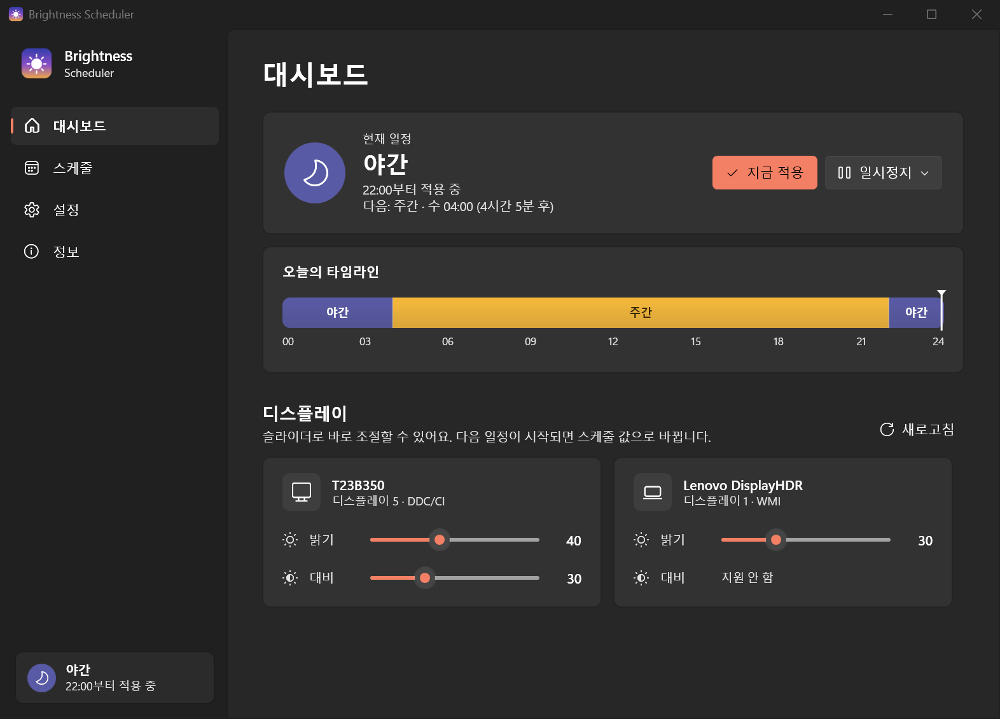
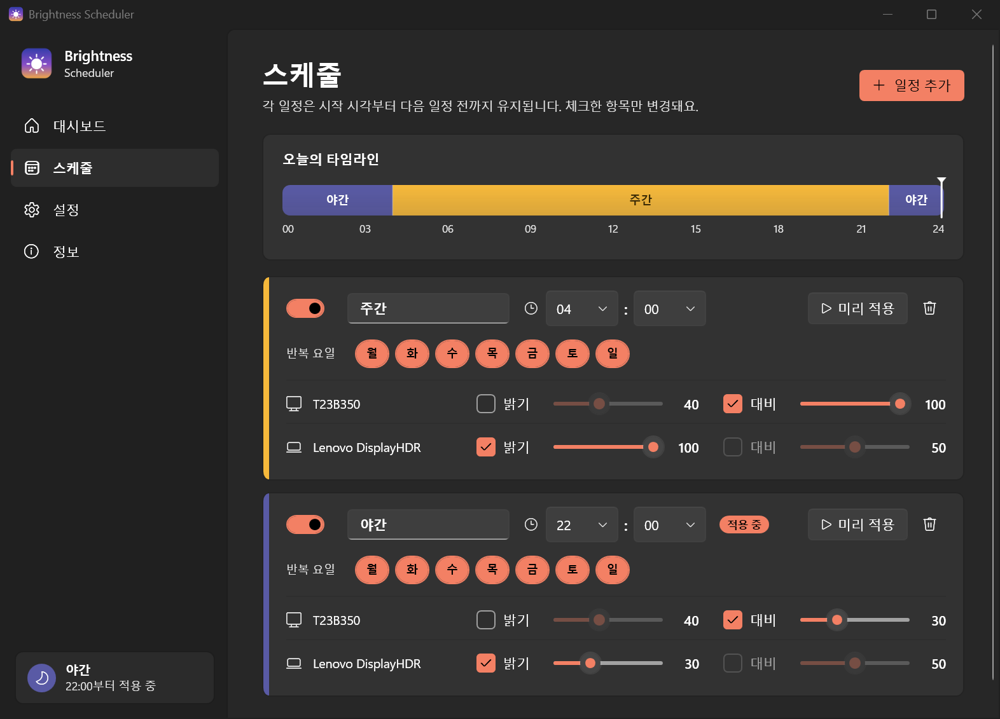

<p align="center">
  
</p>

<h1 align="center">Brightness Scheduler</h1>

<p align="center">
  시간표에 맞춰 노트북 화면과 외부 모니터의 밝기·대비를 자동으로 조절합니다. 다른 프로그램은 필요 없어요.<br/>
  <a href="README.md">English</a> · <b>한국어</b>
</p>

<p align="center">
  
</p>

## 주요 기능

- **시간 기반 스케줄**: 일정을 원하는 만큼 추가할 수 있습니다(예: 07:00 주간, 20:00 저녁, 23:00 야간). 각 일정은 다음 일정이 시작될 때까지 유지되고, 자정을 넘겨도 이어집니다.
- **디스플레이별·항목별 설정**: 디스플레이마다 밝기와 대비를 따로 지정합니다. 체크하지 않은 항목은 바꾸지 않습니다.
- **요일 반복**: 예를 들어 주말에는 늦게 밝아지는 일정을 따로 둘 수 있습니다.
- **노트북과 외부 모니터 모두 지원**
  - 노트북 내장 화면: WMI
  - 외부 모니터: **DDC/CI** (밝기 `VCP 0x10`, 대비 `VCP 0x12`)
- **실시간 수동 조절**: 대시보드의 슬라이더로 바로 바꿀 수 있습니다.
- **부드러운 전환**: 일정이 바뀔 때 최대 10분에 걸쳐 천천히 변경합니다(선택).
- **자동 복구**: 절전 해제, 잠금 해제, 모니터 연결 시 다시 적용합니다. 값이 초기화되는 모니터를 위한 주기적 재적용 옵션도 있습니다.
- **일시정지**: 1시간, 다음 일정까지, 또는 다시 켤 때까지 멈출 수 있습니다(창이나 트레이에서).
- **트레이 상주**: Windows 시작 시 자동 실행(선택), 해/달 트레이 아이콘, 알림을 지원합니다.
- 오늘의 타임라인 표시, 라이트·다크 테마(Windows 설정 따름), **한국어·영어** UI
- 설정은 JSON 파일로 저장되고, **포터블 모드**도 지원합니다.

<p align="center">
  
</p>

## 다운로드 및 설치

1. **[Releases](../../releases)**에서 최신 exe를 받습니다.
   - `BrightnessScheduler-x.y.z-win-x64.exe`: **권장**합니다. 단일 파일이라 따로 설치할 것이 없습니다(약 65MB).
   - `BrightnessScheduler-x.y.z-win-x64-small.exe`: 용량이 작지만 [.NET 10 데스크톱 런타임](https://dotnet.microsoft.com/download/dotnet/10.0)이 필요합니다.
2. exe를 계속 둘 위치(예: `%LOCALAPPDATA%\Programs\BrightnessScheduler\`)에 놓고 실행합니다.
3. 처음 실행하면 디스플레이를 찾아 기본 일정을 만듭니다(07:00 주간은 밝기 100%, 22:00 야간은 30%). **스케줄** 페이지에서 원하는 대로 바꾸면 자동 저장됩니다.

> 릴리스 파일은 SignPath Foundation 승인 후 코드 서명되어 배포됩니다([코드 서명 정책](CODE_SIGNING.md)). 승인 전이거나 새 서명의 평판이 쌓이는 동안에는 SmartScreen 경고가 뜰 수 있으니 **추가 정보 → 실행**을 누르세요. 릴리스마다 `SHA256SUMS.txt`가 있어 다운로드한 파일을 검증할 수 있습니다.

창을 닫아도 트레이에서 계속 실행됩니다. 완전히 끄려면 **트레이 아이콘 → 종료**를 선택하세요.

**제거:** 설정 › **제거**(또는 `BrightnessScheduler.exe --uninstall`)를 실행하면 자동 실행 등록과 설정·로그가 삭제됩니다. 그다음 exe 파일만 지우면 됩니다.

## 요구 사항

- Windows 10 / 11 (x64)
- 외부 모니터는 모니터 OSD 메뉴에서 **DDC/CI가 켜져 있어야** 합니다. 대부분의 모니터가 지원하지만, 일부 독·KVM·어댑터(특히 USB-C/DisplayLink)는 DDC/CI 신호를 전달하지 않습니다.

## 문제 해결

| 증상 | 해결 방법 |
|---|---|
| 외부 모니터가 '지원 안 함'으로 표시됨 | 모니터 OSD에서 DDC/CI를 켜고, 다른 케이블이나 포트를 시도한 뒤 **새로고침**을 누르세요. |
| 노트북 밝기가 저절로 돌아감 | **설정 › 시스템 › 디스플레이**에서 '자동 밝기 / 콘텐츠 기반 밝기'를 끄고, 전원 관리의 적응 밝기도 확인하세요. |
| 모니터 전원을 껐다 켜면 값이 초기화됨 | 설정에서 **주기적 재적용**을 켜세요. |
| 그 밖의 문제 | **정보 › 로그 보기**(`%APPDATA%\BrightnessScheduler\app.log`)를 확인하세요. |

## 설정 파일

`%APPDATA%\BrightnessScheduler\settings.json`

**포터블 모드**: exe와 같은 폴더에 `settings.json`이 있으면 그 파일을 사용합니다(USB 등에서 쓸 때 편리).

형식은 [English README](README.md#settings-file)의 예시를 참고하세요. `days`는 0=일요일 ~ 6=토요일입니다.

명령줄: `BrightnessScheduler.exe --tray`로 실행하면 창 없이 트레이로 시작합니다(자동 실행에 사용). 이미 실행 중일 때 다시 실행하면 기존 창이 열립니다.

## 소스에서 빌드

[.NET 10 SDK](https://dotnet.microsoft.com/download/dotnet/10.0)가 필요합니다.

```powershell
git clone https://github.com/devcol-main/BrightnessScheduler.git
cd BrightnessScheduler
dotnet run --project src/BrightnessScheduler      # 디버그 실행
./build.ps1                                       # 배포용 exe → .\dist
```

`v1.1.0` 같은 태그를 push하면 GitHub Actions가 exe 두 개를 빌드하고, SignPath가 설정되어 있으면 서명까지 한 뒤 새 릴리스에 첨부합니다. 로컬 서명은 `./sign.ps1`을 사용하세요([CODE_SIGNING.md](CODE_SIGNING.md) 참고).

## 코드 서명 정책

Free code signing provided by [SignPath.io](https://about.signpath.io), certificate by [SignPath Foundation](https://signpath.org). 역할, 개인정보 정책 등 자세한 내용은 [CODE_SIGNING.md](CODE_SIGNING.md)를 참고하세요.

## 라이선스

[MIT](LICENSE)
