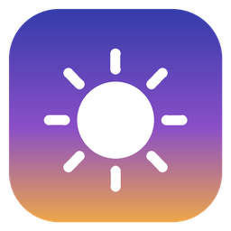
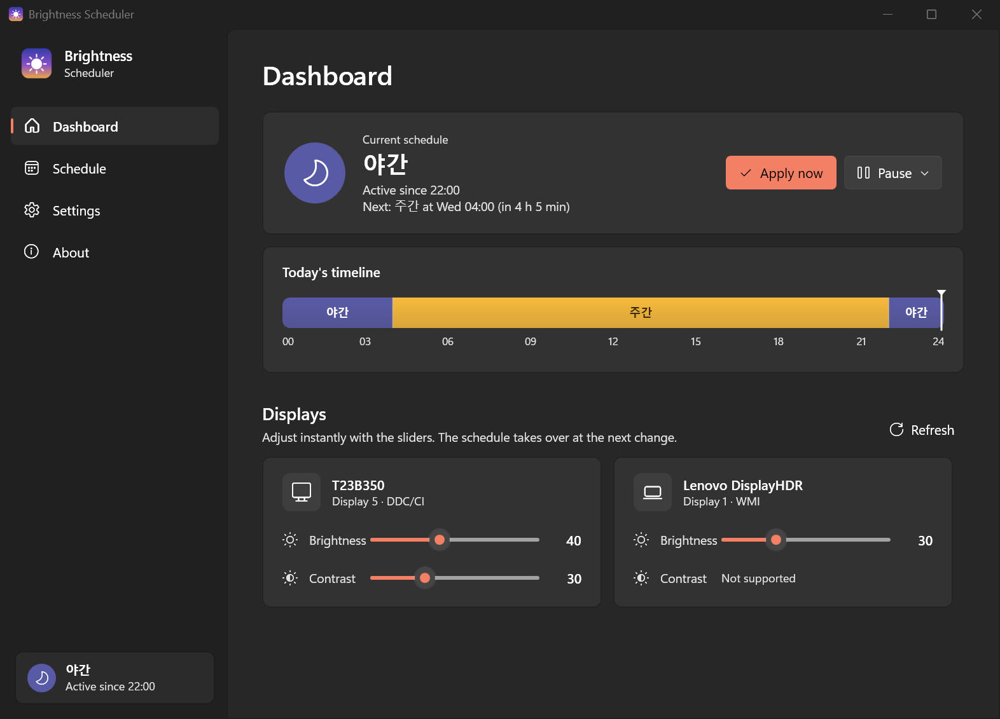
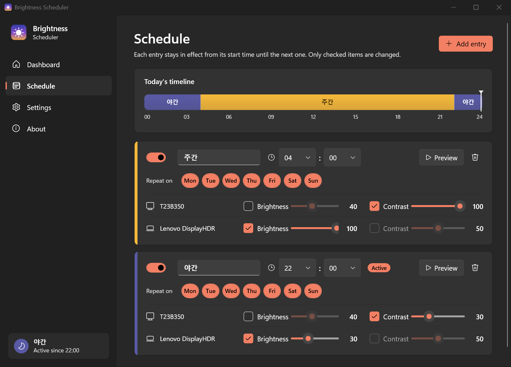

<p align="center">
  
</p>

<h1 align="center">Brightness Scheduler</h1>

<p align="center">
  Automatically dim your laptop screen and external monitors on a schedule — no other tools required.<br/>
  <b>English</b> · <a href="README.ko.md">한국어</a>
</p>

<p align="center">
  
</p>

## Features

- **Time-based schedule** — add as many entries as you like (e.g. *Day* at 07:00, *Evening* at 20:00, *Night* at 23:00). Each entry stays in effect until the next one starts, including across midnight.
- **Per-display, per-property control** — set brightness and/or contrast for every display individually. Unchecked items are left untouched.
- **Repeat on specific days** — e.g. a later wake-up schedule for weekends.
- **Works with laptops and external monitors**
  - Built-in laptop panels via WMI
  - External monitors via **DDC/CI** (brightness `VCP 0x10`, contrast `VCP 0x12`)
- **Live manual control** from the dashboard sliders.
- **Smooth transitions** — optionally fade over up to 10 minutes when an entry starts.
- **Self-healing** — re-applies after sleep/wake, unlock, and monitor hot-plug. Optional periodic re-apply for monitors that reset themselves.
- **Pause** for 1 hour, until the next change, or indefinitely (from the window or tray).
- **System tray app** — starts with Windows (optional), sun/moon tray icon, notifications.
- **Today's timeline** visualisation, light / dark theme (follows Windows), **Korean / English** UI.
- Settings are a plain JSON file; **portable mode** supported.

<p align="center">
  
</p>

## Download & install

1. Download the latest exe from **[Releases](../../releases)**
   - `BrightnessScheduler-x.y.z-win-x64.exe` — **recommended**, single file, nothing else to install (~65 MB)
   - `BrightnessScheduler-x.y.z-win-x64-small.exe` — tiny, but requires the [.NET 10 Desktop Runtime](https://dotnet.microsoft.com/download/dotnet/10.0)
2. Put it somewhere permanent, e.g. `%LOCALAPPDATA%\Programs\BrightnessScheduler\`, and run it.
3. On first launch your displays are detected and a default schedule is created (Day 07:00 → 100 %, Night 22:00 → 30 %). Adjust it on the **Schedule** page — changes are saved automatically.

> Release binaries are code-signed via SignPath Foundation once the application is approved — see the [code signing policy](CODE_SIGNING.md). Until then (or while a new signature is still building SmartScreen reputation) Windows may show a SmartScreen warning: click **More info → Run anyway**. Each release includes `SHA256SUMS.txt` to verify the download.

Closing the window keeps the app running in the tray. Use **tray icon → Exit** to quit.

**Uninstall:** Settings › **Uninstall** (or `BrightnessScheduler.exe --uninstall`) removes the autostart entry, settings and log — then delete the exe.

## Requirements

- Windows 10 / 11 (x64)
- External monitors: **DDC/CI must be enabled** in the monitor's on-screen menu. Most monitors support it; some docks, KVMs and adapters (especially USB-C/DisplayLink) do not pass DDC/CI through.

## Troubleshooting

| Problem | Fix |
|---|---|
| External monitor shows *Not supported* | Enable DDC/CI in the monitor OSD, try another cable/port, then press **Refresh**. |
| Laptop brightness changes back by itself | Turn off *Change brightness automatically / based on content* in **Settings › System › Display**, and check your power plan's adaptive brightness. |
| Values reset after the monitor is power-cycled | Enable **Periodic re-apply** in Settings. |
| Something else | Open **About › Open log** (`%APPDATA%\BrightnessScheduler\app.log`). |

## Settings file

`%APPDATA%\BrightnessScheduler\settings.json`

**Portable mode:** if a `settings.json` exists next to the exe, that file is used instead (handy on a USB stick).

```jsonc
{
  "language": "auto",            // auto | ko | en
  "theme": "system",             // system | light | dark
  "runAtStartup": true,
  "transitionSeconds": 0,        // fade duration, 0 = instant
  "reapplyOnSystemEvents": true, // after wake / unlock / display change
  "enforceIntervalMinutes": 0,   // 0 = off
  "showNotifications": true,
  "entries": [
    {
      "name": "Night", "enabled": true, "time": "22:00",
      "days": [0,1,2,3,4,5,6],     // 0 = Sunday
      "targets": [
        { "monitorId": "SAM093A#5&936221D&0&UID8449",
          "setBrightness": false, "brightness": 40,
          "setContrast": true,    "contrast": 30 }
      ]
    }
  ]
}
```

Command-line: `BrightnessScheduler.exe --tray` starts hidden in the tray (used for autostart). Launching a second copy just brings up the existing window.

## Building from source

Requires the [.NET 10 SDK](https://dotnet.microsoft.com/download/dotnet/10.0).

```powershell
git clone https://github.com/devcol-main/BrightnessScheduler.git
cd BrightnessScheduler
dotnet run --project src/BrightnessScheduler      # run in debug
./build.ps1                                       # release exes -> .\dist
```

Pushing a tag like `v1.1.0` builds both exes with GitHub Actions, signs them through SignPath (when configured) and attaches them to a new release. `./sign.ps1` can sign locally — see [CODE_SIGNING.md](CODE_SIGNING.md).

### Project layout

```
src/BrightnessScheduler/
  Services/MonitorService.cs     DDC/CI + WMI hardware access, display detection
  Services/SchedulerService.cs   active-entry logic, transitions, wake/unlock/hot-plug handling
  Services/ScheduleMath.cs       pure schedule calculations (active / next / timeline)
  ViewModels/                    MVVM view models
  Views/                         WPF window (Fluent theme), tray icon, styles
  Localization/Loc.cs            Korean / English strings
```

## Code signing policy

Free code signing provided by [SignPath.io](https://about.signpath.io), certificate by [SignPath Foundation](https://signpath.org). Roles, privacy policy and details: [CODE_SIGNING.md](CODE_SIGNING.md).

## License

[MIT](LICENSE)
